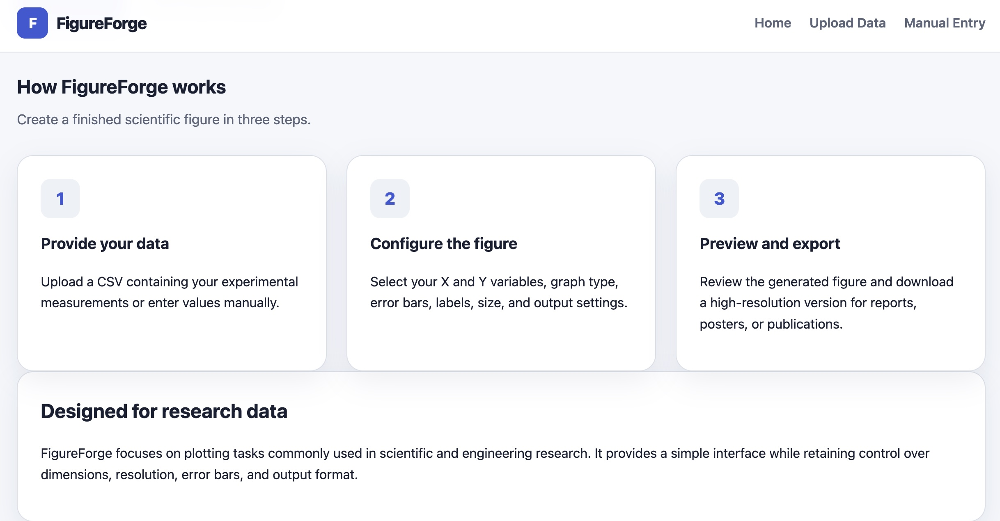
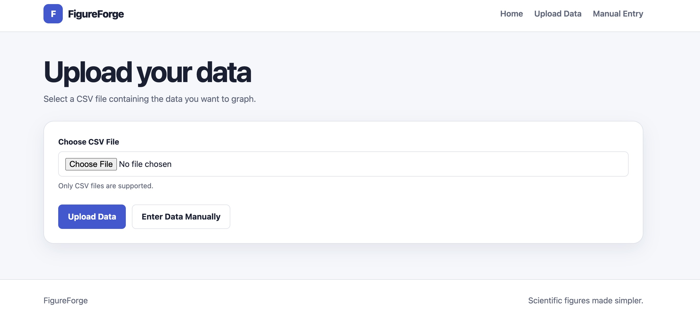
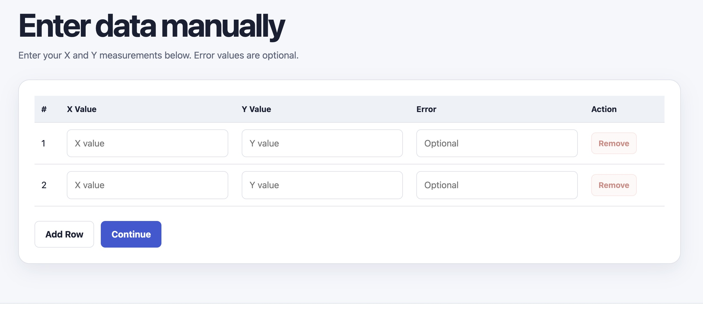
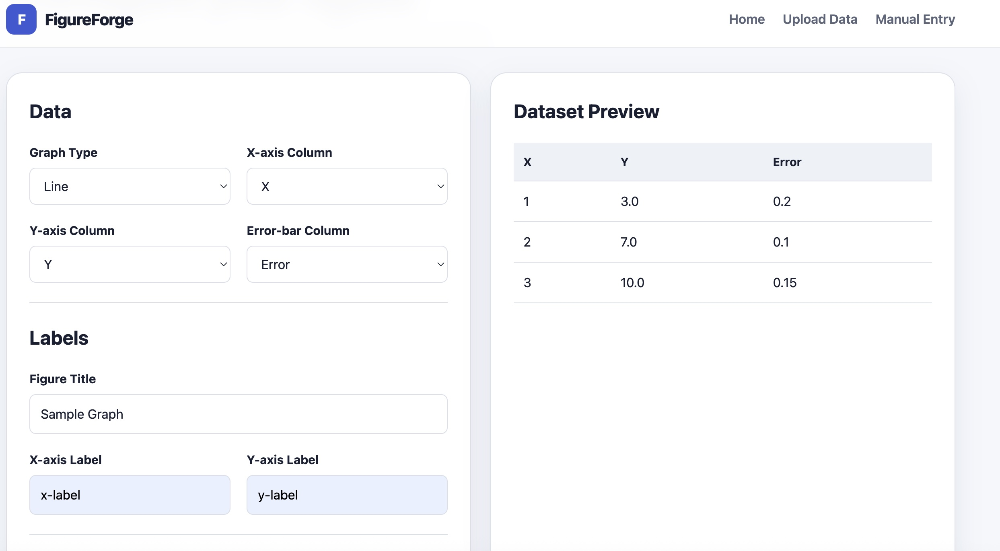
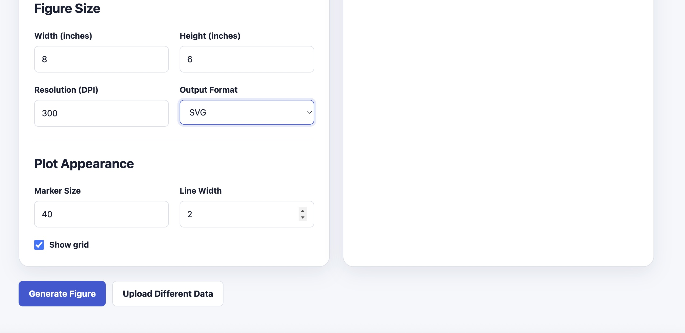
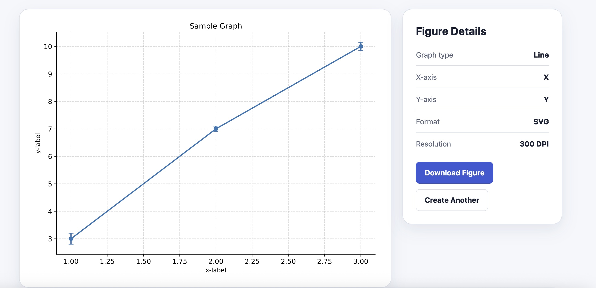
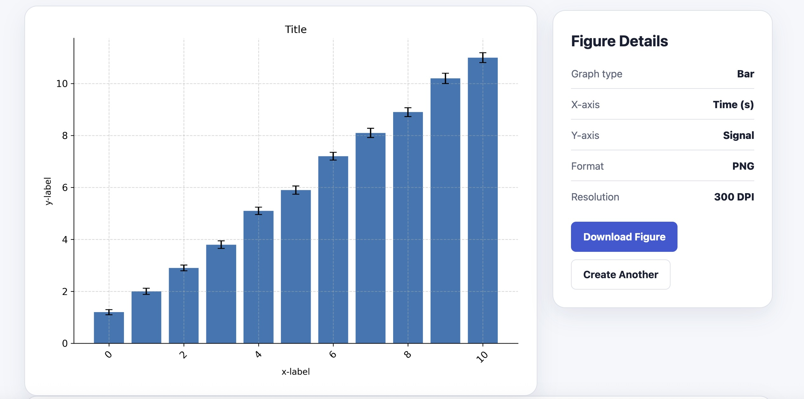
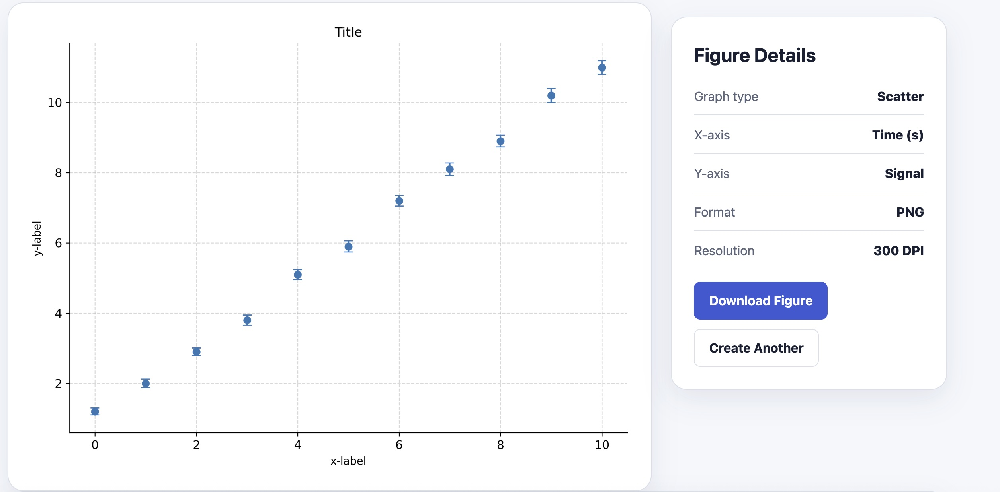

# Figure Forge 
#### A data visualization tool that generates publication quality graphs from csv files
#### Video Demo
🚀 **[Launch Figure Forge](https://youtu.be/rTceheu_2so)**
## Features

## File uploading
#### Figure Forge can handle csv files of large sizes. This has huge advantages because it allows users to easily generate graphs without the need for excel or any other non-user friendly and nonintuitive data visualization platform. Therefore, by allowing the user to upload data which is most likely already organized in a csv file, Figure Forge greatly streamlines the process of quality data visualization.

## Graphing
#### Figure Forge can generate three different types of graphs:
#### - Scatter plot
#### - Line graph
#### - Bar chart
#### The graphs are very customizable, allowing users to choose their own width, height, resolution, line thickness, grid visualization, and importantly output format.The website allows the graphs to be outputted in three different formats: png, svg, and pdf with png being the default. All of the graphs generated can then be downloaded directly onto the computer and used for whatever purpose the user may desire.

## Manual Entry
#### - While one of the more convenient features of Figure Forge is the ability to upload data, the user can also choose to enter it manually. The manual data entry requires at least two x and two y values to be inputted before the user can begin to create a graph. Additionally, there is an option for an error column should the user wish to have error bars on their graph.

## Images
## Home Page


## Project Description



## Data Upload



## Manual Entry



## Graph Settings




## Example Graphs



# Running FigureForge Locally

## Prerequisites

#### Before running FigureForge, make sure you have:

#### - Python 3.10 or newer installed
#### - Git installed
#### - A terminal or command prompt


## 1. Clone the repository

#### ```bash
#### git clone https://github.com/ggordon4810/dataanalytics.github.io.git
#### ```

####  Change into the project directory:

####  ```bash
####  cd dataanalytics.github.io
####  ```


####  2. (Recommended) Create a virtual environment

### Windows

####  ```bash
####  python -m venv venv
####  venv\Scripts\activate
####  ```

### macOS / Linux

####  ```bash
####  python3 -m venv venv
####  source venv/bin/activate
####  ```


####  3. Install the required packages

####  Install all dependencies listed in `requirements.txt`:

####  ```bash
####  pip install -r requirements.txt
####  ```

####  4. Run the Flask application

####  Start the development server:

####  ```bash
####  python app.py
####  ```

####  You should see output similar to:

####  ```
####  * Running on http://127.0.0.1:5000
####  ```

####  5. Open FigureForge

####  Open your web browser and navigate to:

####  ```
####  http://127.0.0.1:5000
####  ```

## Why I Made This Project
#### During my research making gadolinium based contrast agents for the lymphatic system, I spent a lot of time visualizing and graphing the data I collected so I could effectively present it to my supervisors. This application helped streamline the process for me so I no longer had to spend a lot of time tinkering in excel until the graph was just as I wanted it to be. Additionally, Figure Forge helps create high quality graphs in a user friendly way, making it easier for the average person to learn and understand how graphs work.

## Author

#### Gabriella Gordon

#### Materials Science student interested in research and development, biomedical materials, nanoparticle characterization, and scientific software.
#### GitHub: ggordon4810
#### LinkedIn: [Gabriella Gordon](https://www.linkedin.com/in/gabriella-gordon-1a7b2536a/)


